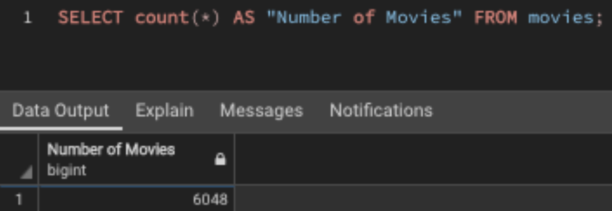
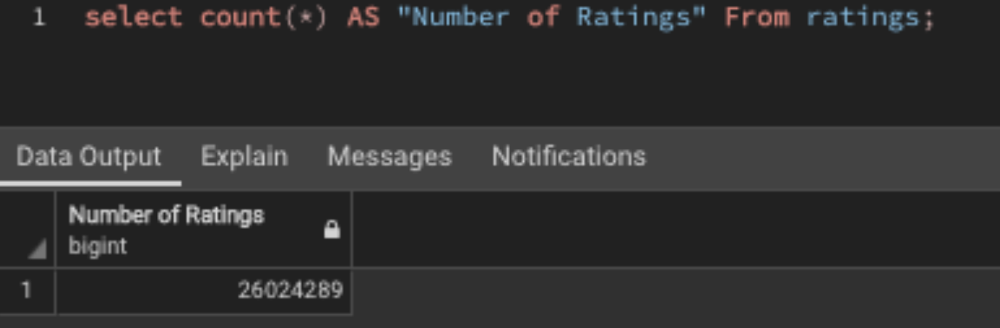

# Extract, Transform, and Load Movie Data

## Overview

The purpose of this project was to gather movie data from both Wikipedia and Kaggle and create a database that can be used to preform analysis for popular movie prediction. I extracted the necessary data from Wikipedia and Kaggle, used python's pandas library to transform the data into a working dataframe, and then loaded it to PostgreSQL.

## Results

After completing the extract, transform, and load process, I had a database with two tables: one for movies and one for ratings. The movies table consists of 31 columns holding a range of information for 6048 different movies.

 The ratings table consists of 5 different columns holding a range of information on over 26 million individual user ratings.

